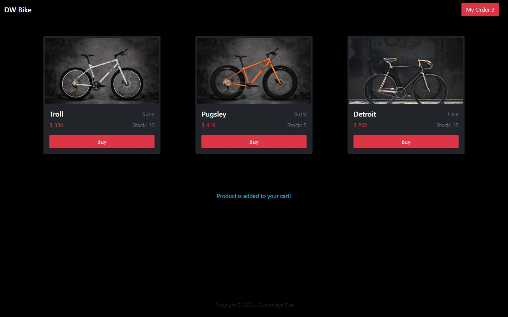
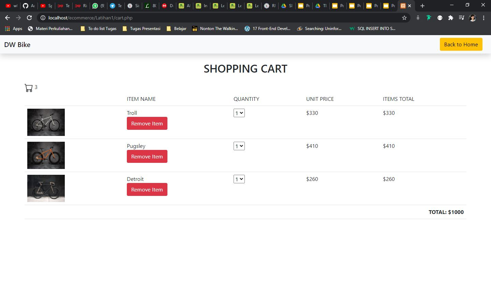
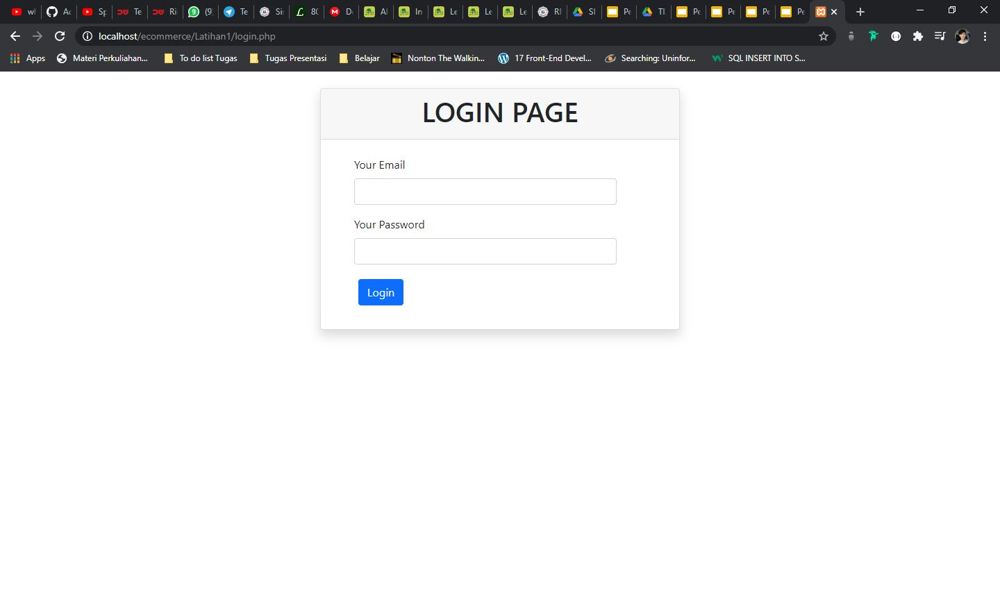

# DWbike-commerce
e-commerce with shopping cart and login using php &amp; mysql

# Tampilan Homepage
Bertujuan untuk tidak terpaku pada keindahan HTML CSS saja seharian.. Disini saya Menggunakan Bootstrap Versi Terbaru yaitu Twitter <a href="https://getbootstrap.com/">Bootstrap 5</a> sebagai pemilihan UI yang efisien.

# Shopping Cart
Terdapat shopping cart setelah kita menekan tombol MyOrder, disini saya menggunakan Array $_SESSION sebagai database sementara dan menggunakan query JOIN untuk mengakses foreign key tabel merk

# 
Setelah membuka cart.php akan di header ke halaman login.php yang dimana datanya di abil dari tabel user

# Bahasa Pemrograman
- PHP
- MySQL
